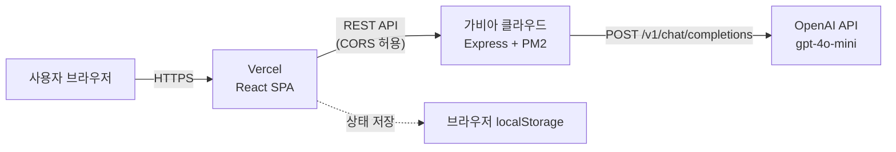
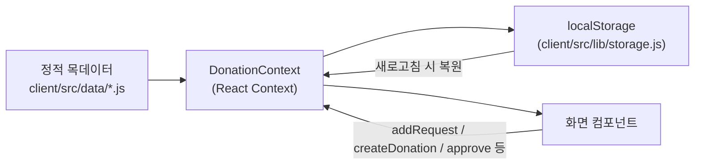
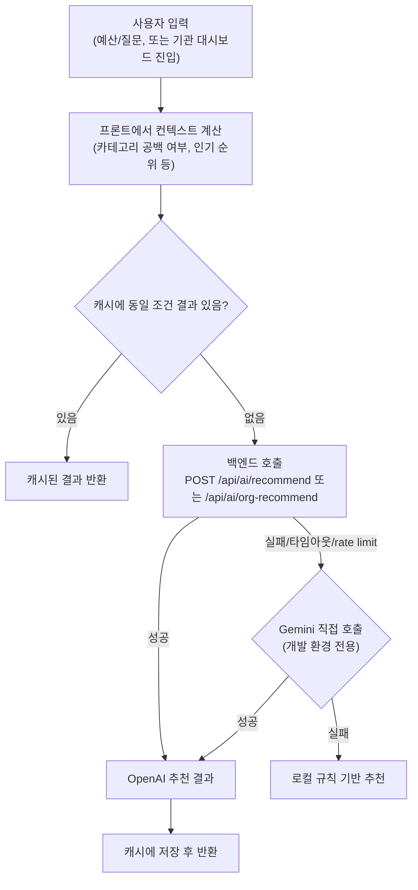

# 🎁 나눔카트

> **투명하고 직관적인 마켓형 물품 후원 플랫폼**
> "현금 후원 대신, 수혜자에게 정말 필요한 물품을 직접 장바구니에 담아 마음을 전하세요."

## 목차

- [한눈에 보기](#한눈에-보기)
- [기술 스택](#기술-스택)
- [시스템 아키텍처](#시스템-아키텍처)
- [데이터 파이프라인 (0단계)](#데이터-파이프라인-0단계)
- [AI 추천 흐름 (2~3단계)](#ai-추천-흐름-23단계)
- [프로젝트 구조](#프로젝트-구조)
- [환경 변수](#환경-변수)
- [로컬 개발](#로컬-개발)
- [스크립트 가이드](#스크립트-가이드)
- [배포](#배포)
- [트러블슈팅](#트러블슈팅)
- [진행 현황 & 다음 단계](#진행-현황--다음-단계)
- [License](#license)

---

## 한눈에 보기

| | |
|---|---|
| **웹사이트** | https://likey-web.vercel.app |
| **백엔드 API** | http://1.201.117.56:5000 *(가비아 클라우드, 도메인·HTTPS 미적용)* |
| **이전 백엔드** | https://likey-web.onrender.com *(Render — 가비아로 이전 완료, 기록용 유지)* |

**데모 로그인** — 회원가입 없이 바로 체험할 수 있습니다.

| 유형 | 이메일 | 비밀번호 |
|---|---|---|
| 개인 후원자 | `user@likey.com` | `user1234` |
| 기관 회원 | `org@likey.com` | `org1234` |

**주요 기능**
- **마켓형 물품 후원** — 현금이 아닌, 기관에 실제로 필요한 물품을 골라 장바구니에 담아 후원
- **후원도우미 AI 챗봇** — 예산이나 자연어 질문("초등학생 학용품 추천해줘" 등)으로 지금 가장 필요한 물품을 AI가 추천
- **기관 대시보드** — 물품 요청 등록(긴급 후원 포함), 후원 수락 관리, 사용 현황, AI 기반 "다음 요청 물품" 추천 등 데이터 분석
- **후원 인증 피드** — 기관이 공개한 인증 사진으로 후원이 실제로 어떻게 쓰였는지 확인
- **개인 후원 활동 요약** — 내가 후원한 내역과 카테고리별 성향 확인
- **기관 수락 게이트** — 결제만으로는 배송되지 않고, 등록된 기관이 수락해야 발송되는 구조로 악용을 방지

---

## 기술 스택

### 🎨 프론트엔드 (`client`)
- **Framework / Build Tool**: React 19, Vite
- **Styling**: Tailwind CSS v4 (`@tailwindcss/vite`)
- **Routing**: `react-router-dom`
- **Icons**: `lucide-react`
- **HTTP 통신**: `axios`
- **상태 관리**: React Context API (`DonationContext`, `AuthContext`, `CartContext`) — 별도 라이브러리 없이 화면 간 공유 상태를 관리
- **Lint**: `oxlint`
- **배포**: Vercel

### ⚙️ 백엔드 (`server`)
- **Runtime / Framework**: Node.js, Express, TypeScript
- **Dev Tools**: `tsx`, `nodemon`
- **AI**: OpenAI SDK (`gpt-4o-mini`)
- **기타**: `cors`, `dotenv`
- **배포**: 가비아 클라우드 (Rocky Linux, PM2로 상시 실행)

---

## 시스템 아키텍처

프론트(Vercel)와 백엔드(가비아 클라우드)가 완전히 분리된 구조입니다. 백엔드는 실제 DB 없이 요청이 올 때마다 OpenAI를 호출하고, 실패 시 자체 폴백 로직으로 넘어갑니다.



- **프론트 ↔ 백엔드**: `axios` 인스턴스(`client/src/lib/api.js`)가 `VITE_API_URL`을 기준으로 호출. 백엔드는 `*.vercel.app`과 로컬 개발 origin을 CORS로 허용.
- **백엔드 ↔ OpenAI**: `server/src/routes/aiRoutes.ts`에서만 호출. 타임아웃(25초)과 재시도(0회, rate limit 오탐 방지)를 명시적으로 설정.
- **DB 없음**: 후원/요청/기관 데이터는 전부 프론트 정적 목데이터 + `localStorage`로 관리됩니다. 자세한 내용은 아래 [데이터 파이프라인](#데이터-파이프라인-0단계) 참고.

---

## 데이터 파이프라인 (0단계)

이 프로젝트는 아직 **실제 DB가 없는 0단계**입니다 — 발표 일정상 백엔드 DB 구축보다 기능 완성도를 우선했습니다(`server/src/routes/itemRoutes.ts`에 조회용 API 골격은 있지만 프론트가 호출하지 않는 미사용 상태).



- **시드**: `items.js`, `organizations.jsx`, `requests.js`, `donations.js`, `proofs.js`
- **상태 관리**: `DonationContext`가 시드를 초기값으로 로드하고, 이후 모든 변경(요청 등록, 후원, 수락/거절, 인증 공개)은 이 Context를 통해서만 일어남
- **영속화**: 변경될 때마다 `localStorage`에 저장 → 새로고침해도 유지(스키마 버전이 바뀌면 자동 초기화)
- 왜 이렇게 했는지, 실제 API로 옮길지에 대한 판단은 [진행 현황 & 다음 단계](#진행-현황--다음-단계) 참고

---

## AI 추천 흐름 (2~3단계)

> 벡터 검색·임베딩을 쓰는 RAG는 아닙니다. 대신 **프론트에서 미리 계산한 사실(fact)을 프롬프트에 구조화해서 주입**하고, AI는 그 안에서만 고르고 문장으로 표현하게 하는 방식입니다 — 실사용 중 "AI가 직접 계산하게 하면 사실을 틀린다"는 걸 발견하고 이렇게 바꿨습니다(아래 트러블슈팅 참고).



- **2단계 (후보 압축)**: 원본 데이터 전체를 보내는 대신, 백엔드가 판단할 최소한의 필드만 압축해서 전송(`recommend.js`의 `buildApiContext`, `orgAnalytics.js`의 `buildCandidates`)
- **3단계 (AI 호출 + 폴백)**: `/api/ai/recommend`(개인 후원자용), `/api/ai/org-recommend`(기관용) 두 엔드포인트가 동일한 3단 폴백(AI → Gemini(dev) → 로컬)을 씀
- **캐싱**: 동일 조건 재요청 시 `client/src/utils/aiCache.js`(프론트 메모리)로 API 재호출을 막음 — 이유는 [트러블슈팅](#트러블슈팅) 참고

---

## 프로젝트 구조

```text
likey-web/
├── client/                          # 🎨 프론트엔드 (React + Vite)
│   ├── public/
│   │   ├── favicon.svg
│   │   └── icons.svg
│   ├── src/
│   │   ├── assets/
│   │   ├── components/              # 공통·재사용 UI 컴포넌트
│   │   │   ├── Header.jsx           # 상단 헤더
│   │   │   ├── CategoryNav.jsx      # 카테고리 내비게이션
│   │   │   ├── UrgentBanner.jsx     # 긴급 후원 배너
│   │   │   ├── AvailableNow.jsx     # 랜딩페이지 서비스 특징 소개
│   │   │   ├── HowItWorks.jsx       # 랜딩페이지 이용 절차 안내(3단계)
│   │   │   ├── StarBar.jsx          # 랜딩페이지 상단 통계(등록 기관·필요 물품 수)
│   │   │   ├── KoreaMap.jsx         # 지역별 기관 분포 대한민국 지도
│   │   │   ├── ItemCard.jsx         # 물품 카드
│   │   │   ├── OrgCard.jsx          # 기관 카드
│   │   │   ├── ProgressBar.jsx      # 후원 진행률 바
│   │   │   ├── ProtectedRoute.jsx   # 로그인 필요 라우트 가드
│   │   │   ├── DevNav.jsx           # 개발용 임시 내비게이션
│   │   │   ├── AiChatbot.jsx        # 후원도우미 AI 챗봇(플로팅)
│   │   │   ├── AiDemo.jsx           # 랜딩페이지 AI 추천 데모 섹션
│   │   │   ├── RecommendCard.jsx    # AI 추천 물품 카드(챗봇·데모 공용)
│   │   │   ├── OrgHeader.jsx        # 기관 대시보드 헤더
│   │   │   ├── MetricCard.jsx       # 대시보드 지표 카드
│   │   │   ├── TabNav.jsx           # 대시보드 탭 내비게이션
│   │   │   ├── RequestRow.jsx       # 물품 요청 목록 행
│   │   │   ├── ApprovalRow.jsx      # 후원 승인 목록 행
│   │   │   ├── UsageTable.jsx       # 수령·사용 현황 테이블
│   │   │   ├── ProofCard.jsx        # 후원 인증 사진 카드
│   │   │   └── CategoryBarChart.jsx # 카테고리별 후원 현황 막대 차트
│   │   ├── pages/                   # 주요 화면 (라우팅 단위)
│   │   │   ├── HomePage.jsx         # 지도 기반 기관 메인 화면
│   │   │   ├── AuthSelectPage.jsx   # 기관/개인·기업 로그인 선택
│   │   │   ├── LoginPage.jsx        # 로그인
│   │   │   ├── MarketPage.jsx       # 카테고리별 마켓 리스트
│   │   │   ├── DetailPage.jsx       # 물품 상세
│   │   │   ├── CartPage.jsx         # 장바구니
│   │   │   ├── FeedPage.jsx         # 후원 인증 피드
│   │   │   └── OrgPage.jsx          # 기관 대시보드(요청등록·승인·현황·데이터분석)
│   │   ├── data/                    # 목데이터 (API 미연동, 프론트에서 직접 사용)
│   │   │   ├── items.js
│   │   │   ├── organizations.jsx
│   │   │   ├── requests.js
│   │   │   ├── donations.js
│   │   │   └── proofs.js            # 후원 인증 사진 목데이터
│   │   ├── contexts/                # React Context 기반 상태 관리
│   │   │   ├── DonationContext.jsx  # 후원·요청·인증 상태(승인 루프 포함)
│   │   │   ├── AuthContext.jsx      # 로그인 상태(개인/기관)
│   │   │   └── CartContext.jsx      # 장바구니 상태
│   │   ├── lib/
│   │   │   ├── api.js               # axios 인스턴스(백엔드 API 호출)
│   │   │   └── storage.js           # localStorage 저장/복원(버전 관리 포함)
│   │   ├── utils/
│   │   │   ├── urgency.js           # 긴급도·달성률 판단 로직
│   │   │   ├── recommend.js         # AI 추천 호출(백엔드→Gemini→로컬 폴백)
│   │   │   ├── geminiRecommend.js   # (개발용) Gemini 직접 호출 — 정리 예정
│   │   │   ├── aiCache.js           # AI 응답 프론트 메모리 캐싱
│   │   │   ├── aiTimeout.js         # AI 응답 지연 시 UX 처리(타임아웃)
│   │   │   ├── chatIntent.js        # 챗봇 인사·감사 등 의도 판별
│   │   │   ├── parseAmount.js       # 채팅 입력에서 금액 파싱
│   │   │   └── orgAnalytics.js      # 기관 카테고리 통계·다음 요청 추천 알고리즘
│   │   ├── App.jsx                  # 라우팅·레이아웃
│   │   ├── App.css
│   │   ├── index.css                # Tailwind 설정(브랜드 색상 토큰)
│   │   └── main.jsx                 # React 진입점
│   ├── index.html
│   ├── package.json
│   ├── package-lock.json
│   ├── vercel.json                  # Vercel 배포용 SPA 라우팅 설정
│   └── vite.config.js
│
├── server/                          # ⚙️ 백엔드 (TypeScript)
│   ├── src/
│   │   ├── index.ts                 # 서버 진입점(CORS·라우터 연결)
│   │   └── routes/
│   │       ├── authRoutes.ts        # 로그인 API(개인/기관)
│   │       ├── itemRoutes.ts        # 물품·기관·요청·후원 조회 API(현재 프론트 미사용)
│   │       └── aiRoutes.ts          # AI 후원 추천 API(recommend / org-recommend)
│   ├── package.json
│   ├── package-lock.json
│   └── tsconfig.json
│
├── .gitignore
├── .oxlintrc.json                   # oxlint 린터 설정
├── LICENSE
└── README.md
```

---

## 환경 변수

두 앱 모두 `.env.example`을 복사해서 `.env`를 만들고 값을 채웁니다.

### `client/.env`
| 변수 | 필수 | 설명 |
|---|---|---|
| `VITE_API_URL` | ✅ | 백엔드 API 주소 (로컬: `http://localhost:5000`) |
| `VITE_GEMINI_API_KEY` | ❌ | 개발 환경 전용. 백엔드 실패 시 Gemini로 직접 폴백하고 싶을 때만 설정(프로덕션 빌드에서는 아예 실행되지 않음) |

### `server/.env`
| 변수 | 필수 | 설명 |
|---|---|---|
| `PORT` | ❌ | 기본값 5000 |
| `OPENAI_API_KEY` | ✅* | 없으면 AI 추천 라우트만 503을 반환하고 나머지 API는 정상 동작 |

---

## 로컬 개발

```bash
git clone https://github.com/MS0526/likey-web.git
cd likey-web
```

**프론트엔드**
```bash
cd client
npm install
cp .env.example .env
npm run dev   # http://localhost:5173
```

**백엔드**
```bash
cd server
npm install
cp .env.example .env   # OPENAI_API_KEY 채워넣기
npm run dev   # http://localhost:5000
```

두 서버를 각각 다른 터미널에서 띄우면 프론트가 백엔드를 바라보며 동작합니다. `OPENAI_API_KEY` 없이도 나머지 기능은 정상 동작합니다(AI 부분만 로컬 규칙 기반 추천으로 자동 대체).

---

## 스크립트 가이드

### `client/package.json`
| 스크립트 | 설명 |
|---|---|
| `npm run dev` | Vite 개발 서버 실행 |
| `npm run build` | 프로덕션 빌드 (`dist/`) |
| `npm run lint` | `oxlint` 실행 |
| `npm run preview` | 빌드 결과 로컬 미리보기 |

### `server/package.json`
| 스크립트 | 설명 |
|---|---|
| `npm run dev` | `nodemon` + `tsx`로 개발 서버 실행(파일 변경 시 자동 재시작) |
| `npm run build` | TypeScript 컴파일 (`dist/`) |
| `npm start` | 컴파일된 `dist/index.js` 실행 (프로덕션용) |

---

## 배포

| | 서비스 | 방식 |
|---|---|---|
| 프론트엔드 | **Vercel** | GitHub 연동, `main` 브랜치 push 시 자동 배포 |
| 백엔드 | **가비아 클라우드** | Rocky Linux VM(2vCore/4GB) — `git pull` → `npm run build` → PM2로 상시 실행. 도메인·nginx·HTTPS는 아직 미적용, IP:포트로 직접 서비스 중 |
| ~~백엔드(이전)~~ | ~~Render~~ | 무료 티어 콜드 스타트 이슈로 가비아 클라우드로 이전 완료 |

백엔드 코드가 바뀌면 서버에 SSH로 접속해 아래를 반복합니다:
```bash
cd ~/likey-web/server
git pull
npm install   # 의존성이 바뀐 경우만
npm run build
pm2 restart nanumcart-api
```

---

## 트러블슈팅

무료 티어로만 운영하면서 실제로 겪은 문제들입니다. 비슷한 스택으로 만드는 분들에게 참고가 됐으면 합니다.

### 1. OpenAI 무료 티어 — 하루 호출 50회 제한

`gpt-4o-mini` 기준 **10 RPM / 50 요청/일**이 조직 전체에 걸려있습니다. 크레딧 잔액과는 무관하고, **실제 카드로 결제한 누적 금액**이 등급(Tier)을 결정하는 구조라, 무료로 지급된 크레딧만으로는 한도가 안 올라갑니다.

- **증상**: 한도를 넘기면 OpenAI SDK의 기본 재시도(2회)가 `Retry-After`(수십 분)를 그대로 기다리다가, 우리 쪽 25초 타임아웃이 먼저 터져 "AI 응답이 지연되고 있습니다"라는 엉뚱한 메시지로 보였습니다.
- **조치**:
  - OpenAI 클라이언트 `maxRetries: 0`으로 설정 + `OpenAI.RateLimitError`를 별도로 잡아 즉시(약 0.6초) 정확한 원인(`rate_limit_exceeded`)을 응답하도록 수정 (`server/src/routes/aiRoutes.ts`)
  - 동일 조건 재요청 시 API를 다시 부르지 않도록 프론트 메모리 캐싱 추가 (`client/src/utils/aiCache.js`) — 특히 기관 대시보드의 "데이터 분석" 탭은 열 때마다 재호출되는 구조라 탭 전환만으로도 한도를 금방 소진했음
  - 어떤 경로로도 AI 응답을 못 받으면 로컬 규칙 기반 추천으로 자동 폴백해, 한도를 넘겨도 기능 자체는 계속 동작

### 2. Render 무료 티어 — 콜드 스타트

15분 이상 요청이 없으면 슬립 상태가 되고, 슬립 이후 첫 요청은 30~60초가 걸렸습니다. 발표 중 첫 요청에서 그만큼 멈추는 걸 보여줄 순 없어서, 백엔드를 가비아 클라우드에서 지원받은 서버로 이전해 상시 실행(PM2)으로 바꿨습니다. Render 링크는 참고용으로 README에 남겨뒀습니다.

### 3. Vercel 무료 티어 — 팀 협업 제한

Vercel Hobby(무료) 플랜은 프로젝트가 **개인 계정에 종속**돼서, 그 계정 소유자가 아니면 대시보드나 환경변수(`VITE_API_URL` 등)에 접근할 수 없습니다. 백엔드를 이전할 때마다 프론트 담당 팀원에게 직접 값 변경을 요청해야 했습니다. 팀 단위로 여러 명이 같이 관리하려면 Vercel Pro(유료) 팀 플랜이 필요합니다 — 이번 프로젝트에서는 팀원에게 요청하는 방식으로 우회했습니다.

---

## 진행 현황 & 다음 단계

**완료**
- 마켓형 물품 후원 전체 흐름(요청 등록 → 후원 → 기관 수락 → 인증 공개)
- 개인/기관 대상 AI 추천 2종(예산 기반 챗봇, 기관용 "다음 요청 물품")
- 백엔드를 Render → 가비아 클라우드로 이전, 상시 실행 구성
- 공개 저장소 전환(README 정리, 라이선스 추가)

**남은 일**
- `itemRoutes.ts` 실제 연동 여부 결정 — 현재는 프론트가 정적 데이터 + `localStorage`만 사용 중이라, 여러 사용자가 실시간으로 상태를 공유하는 데모가 필요해지면 이 API로 옮기는 작업이 필요합니다

---

## License

[MIT](./LICENSE)
